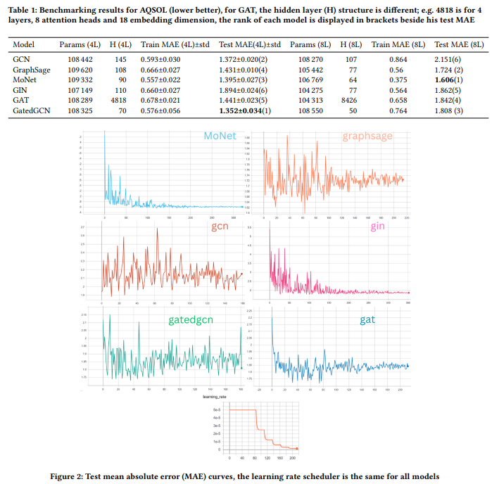

This project was as part of the course [Geometric data analysis](https://www.master-mva.com/cours/geometric-data-analysis/).

We review the paper: [Benchmarking Graph Neural Networks](https://arxiv.org/abs/2003.00982) and find some limitations of doing empirical benchmarks.

